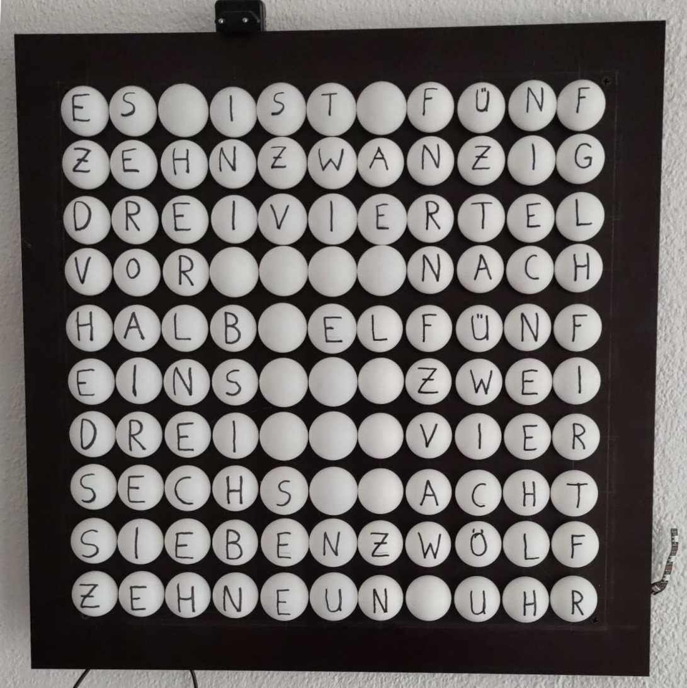
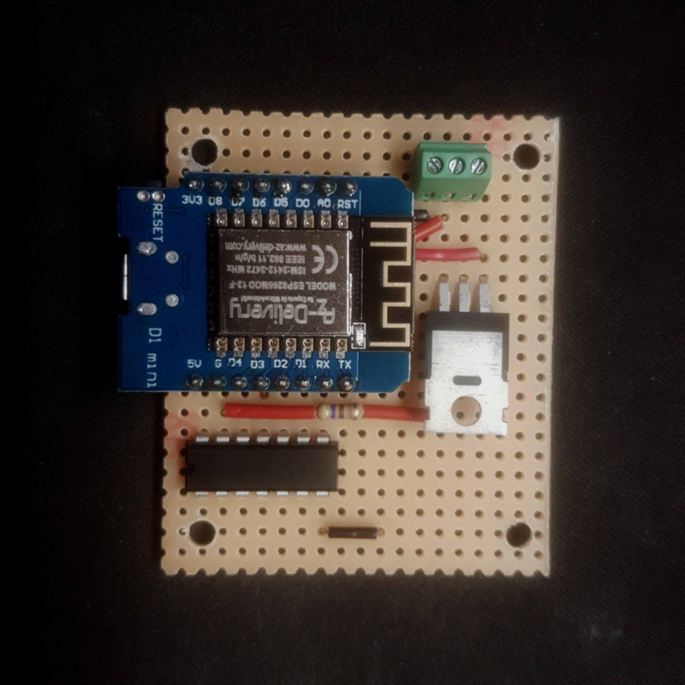

# Letter Clock
<p align='center'>
    
    
</p>

NTP enabled letter clock based on the Wemos D1 mini development board (ESP8266),
using WS2812B addressable LEDs.

The [case](https://cad.onshape.com/documents/4499ea33e3b7b60a9a4c16a8/w/5303deac9d41c1590420c17e/e/a929c920a618501ad4db52fa?renderMode=0&uiState=67be1593580464704f1ff569) for the circuit can be 3D printed.

## Flashing
Connect the development board and run
```bash
pio run -t upload
```
